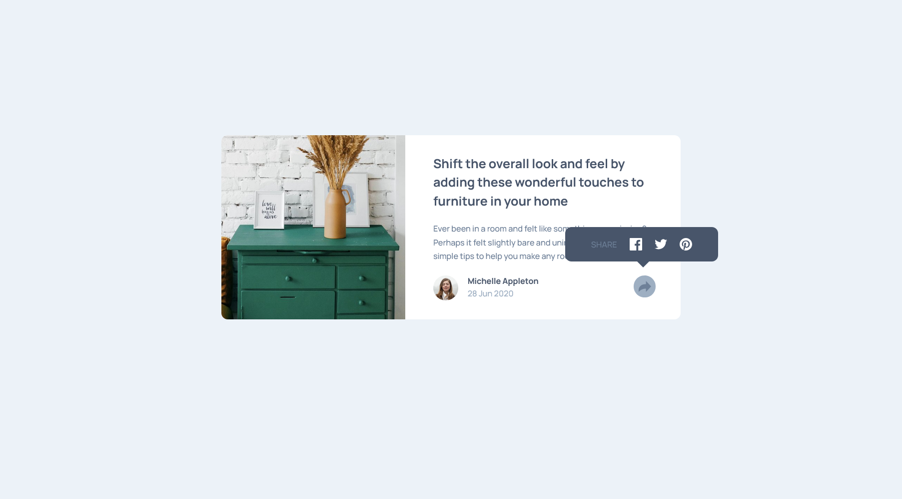

# Frontend Mentor - Article preview component solution

This is a solution to the [Article preview component challenge on Frontend Mentor](https://www.frontendmentor.io/challenges/article-preview-component-dYBN_pYFT). Frontend Mentor challenges help you improve your coding skills by building realistic projects. 

## Table of contents

- [Overview](#overview)
  - [Screenshot](#screenshot)
  - [Links](#links)
- [My process](#my-process)
  - [Built with](#built-with)
  - [What I learned](#what-i-learned)
  - [Continued development](#continued-development)
  - [Useful resources](#useful-resources)
- [Author](#author)
- [Acknowledgments](#acknowledgments)

## Overview

### Screenshot




### Links

- Solution URL: [Solution here](https://github.com/MariaCMontO/card-feature-cmo)

## My process

### Built with

- Semantic HTML5 markup
- CSS custom properties
- Flexbox

### What I learned

With this project, I learned how to include javascript interactions, and doing that i learned how to aply diferent properties regarding the window dimension.

```js
shareButton = document.getElementById("shareButton");
tooltip = document.getElementById("tooltip")
avatarContainer = document.getElementById("avatar-container");
shareIconTooltip=document.getElementById("share-icon-tooltip");

shareButton.addEventListener("click", () => {

    const isDesktop = window.innerWidth >= 768;

    if (!isDesktop) {
        avatarContainer.classList.add("is-hidden");
    }else{
        shareIconTooltip.classList.toggle("is-hidden");
        shareButton.classList.toggle("active")
    }
    tooltip.classList.toggle("is-hidden");
    tooltip.classList.toggle("tooltip-container");
})
```
Other important thing I learned is how to include elements in the middle of the content usign position property, I also learned how to use pseudo-elements like ::after in some classes to add other elements without ussing HTML. To achieve this design its important to add content:"", in this way I could create a triangle.

```css
.tooltip-container {
        position: absolute;
        width: 24.5rem;
        height: 5.5rem;
        top: 50%;
        right: -6rem;
        background-color: var(--Very-Dark-Grayish-Blue);
        padding: 1rem 2rem;
        border-radius: 10px;
        display: flex;
        align-items: center;
        justify-content: center;
        gap: 2rem;
        font-size: 1.3rem;
        color: white;
        transition: 0.3s ease;
    }

    .tooltip-container::after {
        content: "";
        position: absolute;
        top: 100%;
        right: 45%;
        border: 10px solid transparent;
        border-top-color: var(--Very-Dark-Grayish-Blue);
    }
```

### Continued development

I definitely want to keep developing interfaces with JavaScript functions, in order to make them more interactive. Other important thing i want to keep in mind the diference between width and max-width.

### Useful resources

## Author

- Frontend Mentor - [@MariaCMontO](https://github.com/MariaCMontO)


## Acknowledgments